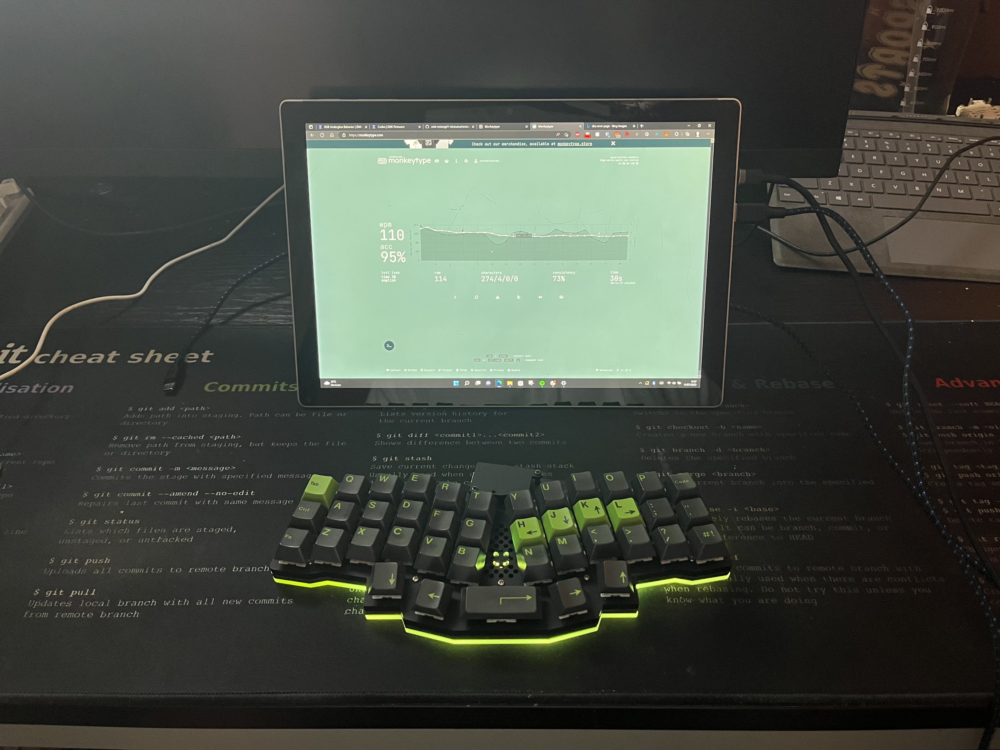

# Reviung41 Keymaps (zmk, nice!nano)


```
Keyboard: Reviung41
Default Layer: QWERTY
Keyboard Firmware: ZMK
Microcontroller: Nice!Nano v2
```

## Reviung41
### QWERTY LAYER (default)
```
╭──────┬──────┬──────┬──────┬──────┬──────╮            ╭──────┬──────┬──────┬──────┬──────┬──────╮
│  TAB │  Q   │  W   │  E   │  R   │  T   │            │  Y   │  U   │  I   │  O   │   P  │ GUI  │
├──────┼──────┼──────┼──────┼──────┼──────┤            ├──────┼──────┼──────┼──────┼──────┼──────┤
│ CTRL │  A   │  S   │  D   │  F   │  G   │            │  H   │  J   │  K   │  L   │  ;   │  "   │
├──────┼──────┼──────┼──────┼──────┼──────┤            ├──────┼──────┼──────┼──────┼──────┼──────┤
│ SHFT │  Z   │  X   │  C   │  V   │  B   │            │  N   │  M   │  ,   │  .   │  /   │ ENT  │
╰──────┴──────┴──────┴──────┼──────┼──────┼────────────┼──────┼──────┼──────┴──────┴──────┴──────╯
                            │LOWER │ BSPC │ ESC(LAYER) │ SPC  │ RAISE│
                            ╰──────┴──────┴────────────┴──────┴──────╯

```


#### LOWER LAYER
```
╭──────┬──────┬──────┬──────┬──────┬──────╮            ╭──────┬──────┬──────┬──────┬──────┬──────╮
│ `/~  │ GUI+Z│ GUI+W│ GUI+E│ GUI+R│ GUI+T│            │  (   │  )   │  =   │  &   │  |   │ DEL  │
├──────┼──────┼──────┼──────┼──────┼──────┤            ├──────┼──────┼──────┼──────┼──────┼──────┤
│ALTTAB│ GUI+A│ GUI+S│ GUI+D│ GUI+F│ GUI+G│            │  {   │  }   │  _   │ GUI+L│  #   │   "  │
├──────┼──────┼──────┼──────┼──────┼──────┤            ├──────┼──────┼──────┼──────┼──────┼──────┤
│ ENTR │ GUI+Z│ GUI+X│ GUI+C│ GUI+V│ GUI+B│            │  [   │  ]   │  <   │  >   │  \   │ ENT  │
╰──────┴──────┴──────┴──────┼──────┼──────┼────────────┼──────┼──────┼──────┴──────┴──────┴──────╯
                            │ ALT  │LOWER │    ENTER   │RAISE │ WIN  │
                            ╰──────┴──────┴────────────┴──────┴──────╯
```


#### RAISE LAYER
```
╭──────┬──────┬──────┬──────┬──────┬──────╮            ╭──────┬──────┬──────┬──────┬──────┬──────╮
│ ESC  │  /   │  1   │  2   │  3   │  -   │            │      │  F1  │  F2  │  F3  │  F10 │      │
├──────┼──────┼──────┼──────┼──────┼──────┤            ├──────┼──────┼──────┼──────┼──────┼──────┤
│      │  *   │  4   │  5   │  6   │  +   │            │      │  F4  │  F5  │  F6  │  F11 │      │
├──────┼──────┼──────┼──────┼──────┼──────┤            ├──────┼──────┼──────┼──────┼──────┼──────┤
│      │  %   │  7   │  8   │  9   │  0   │            │      │  F7  │  F8  │  F9  │  F12 │      │
╰──────┴──────┴──────┴──────┼──────┼──────┼────────────┼──────┼──────┼──────┴──────┴──────┴──────╯
                            │  ALT │LOWER │    BSPC    │RAISE │ WIN  │
                            ╰──────┴──────┴────────────┴──────┴──────╯
```


#### SPACE LAYER
```
╭──────┬──────┬──────┬──────┬──────┬──────╮            ╭──────┬──────┬──────┬──────┬──────┬──────╮
│ ESC  │      │      │      │      │      │            │      │      │      │      │      │      │
├──────┼──────┼──────┼──────┼──────┼──────┤            ├──────┼──────┼──────┼──────┼──────┼──────┤
│      │LSHIFT│      │      │ PSCRN│GUISPC│            │ LEFT │ DOWN │  UP  │ RGHT │      │      │
├──────┼──────┼──────┼──────┼──────┼──────┤            ├──────┼──────┼──────┼──────┼──────┼──────┤
│      │ NEXT │ PREV │ PLAY │      │      │            │      │      │      │      │      │      │
╰──────┴──────┴──────┴──────┼──────┼──────┼────────────┼──────┼──────┼──────┴──────┴──────┴──────╯
                            │  ALT │LOWER │            │RAISE │ WIN  │
                            ╰──────┴──────┴────────────┴──────┴──────╯
```


#### NAVIGATION LAYER
```
╭──────┬──────┬──────┬──────┬──────┬──────╮            ╭──────┬──────┬──────┬──────┬──────┬──────╮
│ ESC  │      │      │      │      │      │            │C_PREV│ PGUP │  UP  │      │      │      │
├──────┼──────┼──────┼──────┼──────┼──────┤            ├──────┼──────┼──────┼──────┼──────┼──────┤
│      │      │      │      │NAV T │      │            │ HOME │ LEFT │ DOWN │ RGHT │ END  │MPLY  │
├──────┼──────┼──────┼──────┼──────┼──────┤            ├──────┼──────┼──────┼──────┼──────┼──────┤
│      │      │      │      │      │      │            │C_NEXT│PGDOWN│      │VLDOWN│ VLUP │MUTE  │
╰──────┴──────┴──────┴──────┼──────┼──────┼────────────┼──────┼──────┼──────┴──────┴──────┴──────╯
                            │ ALT  │LOWER │    SPACE   │RAISE │ WIN  │
                            ╰──────┴──────┴────────────┴──────┴──────╯
```


#### ADJUST LAYER
```
(RGB)                                                   (BLUETOOTH)
╭──────┬──────┬──────┬──────┬──────┬──────╮            ╭──────┬──────┬──────┬──────┬──────┬──────╮
│ BRI+ │ SAT+ │ HUE+ │ ANI+ │      │ TOG  │            │  BT1 │ BT2  │ BT3  │ BT4  │ BT5  │BT_CLR│
├──────┼──────┼──────┼──────┼──────┼──────┤            ├──────┼──────┼──────┼──────┼──────┼──────┤
│ BRI- │ SAT- │ HUE- │ ANI- │      │      │            │      │      │      │EP_ON │EP_OFF│EP_TOG│
├──────┼──────┼──────┼──────┼──────┼──────┤            ├──────┼──────┼──────┼──────┼──────┼──────┤
│      │      │      │      │      │      │            │      │      │      │O_USB │O_BLE │OUTTOG│
╰──────┴──────┴──────┴──────┼──────┼──────┼────────────┼──────┼──────┼──────┴──────┴──────┴──────╯
                            │ ALT  │      │   ENTER    │      │ WIN  │
                            ╰──────┴──────┴────────────┴──────┴──────╯
```
